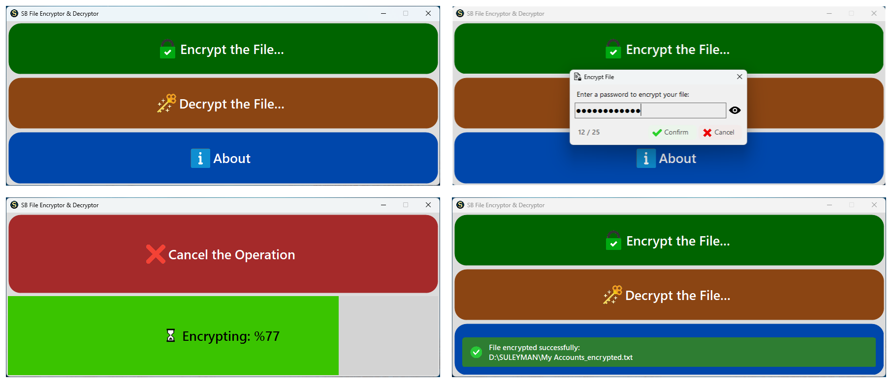

<div align="center">


# SB File Encryptor & Decryptor

This project is not open source. It is distributed as source-available software under a custom license for review and evaluation purposes.

A C# and Windows Forms based file encryption and decryption tool designed for secure local file protection and reliable handling of sensitive data.

<br>

<div align="center">

  
  
  


</div>

</div>

---

## 🚀 Features of the Application

* 🔑 **Password Protection** – Protect your files with a password of your choice.
* 🔒 **Versatile Security** – Secure Office documents, archives, media files, and more.
* 🗂️ **Wide File Support** – Encrypt photos, videos, PDFs, ZIP/RAR archives, and virtually any file type.
* 👤 **User-Friendly Interface** – Modern and responsive design focused on simplicity.
* ⚡ **Fast & Efficient** – Optimized for performance and stability, even with large files.
* 🕵️ **Privacy-Focused** – Prevent unauthorized access to sensitive and confidential data.
* 📊 **Real-Time Progress Tracking** – Monitor encryption and decryption progress live.
* ⏹️ **Operation Cancellation** – Safely cancel long-running operations whenever needed.
* 🔔 **Smart Notifications** – Built-in Snackbar notification system for clear user feedback.
* 👁️ **Password Visibility Toggle** – Easily verify passwords before processing.
* 📱 **DPI-Aware Design** – Sharp and responsive interface across different monitor resolutions and scaling factors.

---

## 🔐 Security Features

* **AES-256-CBC Encryption** for strong file protection.
* **PBKDF2-SHA256 Key Derivation** with **100,000 iterations**.
* **Unique 32-byte Random Salt** generated for every encrypted file.
* **Cryptographically Secure Random Number Generation (CSPRNG)** for secure salt and IV generation.
* **Encrypted File Signature Validation (SB_EncryptedFile header)** – Ensures file authenticity and detects invalid or unsupported files before decryption.
* **Password Validation Protection** to detect incorrect passwords.
* **Corrupted File Detection** to prevent invalid decryption attempts.
* **Local-Only Processing** – No cloud services, uploads, telemetry, or external communication.

---

## ⚙️ Under the Hood (Technical Specs)

This application is built with security, performance, and reliability in mind:

* **AES-256 Encryption** – Industry-standard AES-256-CBC encryption.
* **PBKDF2-SHA256 Key Derivation** – 100,000 iterations with unique 32-byte random salts.
* **Secure Random Generation (CSPRNG)** – Ensures cryptographically strong randomness for salts and IVs.
* **File Signature Validation (SB_EncryptedFile header)** – Ensures file integrity and authenticity before decryption.
* **Corruption & Password Validation** – Detects corrupted files and incorrect passwords.
* **Asynchronous Processing** – Uses `async/await` to keep the UI responsive.
* **Large File Support** – Stream-based processing prevents loading entire files into memory.
* **1 MB Buffered I/O** – Optimized file streaming for large file performance.
* **Stream-Based File Processing** – Processes files in chunks without full memory usage.
* **Operation Cancellation** – Encryption and decryption can be safely canceled.
* **Automatic Cleanup** – Removes partially generated output files after cancellation or failure.
* **Disk Space Validation** – Verifies available storage space before processing.
* **Locked File Detection** – Prevents operations on files currently in use by other applications.
* **Input/Output Collision Protection** – Prevents accidental overwriting of source files.
* **Real-Time Progress Tracking** – Live progress updates during encryption/decryption.
* **Modern UX Components** – Snackbar notifications, password visibility toggle, character counter, and animated progress UI.
* **DPI-Aware Interface** – Fully responsive UI across different display scaling settings.
> [!IMPORTANT]
> A unique random IV is generated per encryption operation and stored alongside the encrypted file to ensure cryptographic security and prevent pattern leakage.

---
## 🎨 UI Components & Custom Controls

The application uses a lightweight custom UI library to enhance the default Windows Forms experience with modern and reusable components.

---

### 🧩 SBCustomControls.dll

A custom-built UI library focused primarily on modern button design and enhanced user interaction.

**Purpose:**
- Provides modern rounded buttons for WinForms UI
- Replaces default system buttons with styled components
- Ensures consistent look and feel across the application

**Features:**
- Rounded / modern button styles
- Hover and click state animations
- DPI-aware rendering
- Lightweight and reusable design
- Easy integration into WinForms projects

> 📦 **Location:** `Lib/SBCustomControls.dll`

---

### 🔔 Snackbar Notification System

A modern, non-blocking notification system used instead of traditional `MessageBox`, improving user experience by avoiding interruptions.

**Features:**
- Toast-style notifications (success, error, warning, info)
- Auto-dismiss with configurable duration (timeout support)
- Smooth animations and modern UI behavior
- Keeps application flow uninterrupted

> 📦 **Location:** `UI/Snackbar.cs`

---

## 🖥️ System Requirements

### Minimum

* Windows 10
* 4 GB RAM
* Dual-Core CPU (Intel Core i3 / AMD Ryzen 3 or equivalent)

### Recommended

* Windows 10 / Windows 11
* 8+ GB RAM
* Quad-Core CPU
* SSD Storage

---

## 🛠️ Installation & Usage

### Clone the Repository

```bash
git clone https://github.com/suleymanbeyhan28/sb-file-encryptor-and-decryptor.git
```

### Build and Run

1. Open the solution (`.sln`) using **Visual Studio 2022** or newer.
2. Ensure the required .NET Framework/runtime is installed.
3. Restore dependencies if necessary.
4. Build the solution.
5. Press **F5** to run the application.

---

## 🖼️ Preview

<p align="center">
  
</p>

<p align="center">
  <i>Modern WinForms UI with custom controls and enhanced UX</i>
</p>

---

## 🎬 Video Demonstration

<p align="center">
  <a href="https://www.youtube.com/watch?v=iy-5eJQGd1I">
    
  </a>
</p>

<p align="center">
  <b> Click the image to watch the full demonstration</b>
</p>

---

## 💾 Data Policy

This application operates **entirely offline**.

It does **not collect, transmit, analyze, or store** any personal information on external servers.

All encryption and decryption operations occur locally on your device. Your files never leave your computer and are never shared with third parties.

---

## 🤝 Source Code Contributions

Bug reports, suggestions, and improvement ideas are welcome.

Whether you'd like to:

* Improve performance
* Fix bugs
* Enhance the user interface
* Improve security
* Add new features

Feel free to contribute.

### Contribution Workflow

1. Fork the repository.
2. Create a feature branch:

```bash
git checkout -b feature/AmazingFeature
```

3. Commit your changes:

```bash
git commit -m "Add AmazingFeature"
```

4. Push to your branch:

```bash
git push origin feature/AmazingFeature
```

5. Open a Pull Request.

---

## 📜 License & Usage

**SB File Encryptor & Decryptor v1.0.0**

Copyright © 2026 Süleyman BEYHAN. All rights reserved.

### Personal Use

The software is free for personal, non-commercial use.

### Commercial Use

For any commercial, corporate, educational, governmental, research, or business-related use, obtaining a commercial license is mandatory.

### Contributions

Forks and Pull Requests are welcome for improving the project.

The source code is provided under a custom license for review and learning purposes. Contributions via pull requests are welcome and may be incorporated at the author's discretion.

However:

* Modified versions may not be redistributed as standalone products.
* Modified versions may not be sold or monetized.
* The original copyright notice must remain intact.

For complete terms, please read the full [LICENSE](LICENSE) file.

---

## 💬 Share Feedback

If you would like to share feedback, report issues, or suggest improvements, you can use the form below:

👉 https://forms.gle/1r5Ho11SU1vEXY9e9

Your feedback helps improve the project and is greatly appreciated.

---

## 📩 Contact & Commercial Licensing

For commercial licensing inquiries:

### 🌐 Website / Blog

[https://suleymanbprojects.blogspot.com/](https://suleymanbprojects.blogspot.com/)

### 📧 Email

sbprojects.requests@gmail.com

---

## ⭐ Support the Project

If you explore or use this project, a GitHub star or feedback is always appreciated.

Your support helps the project grow and motivates future development.

⭐ **Star the repository if you like it!** ⭐Star the repository if you like it!** ⭐
