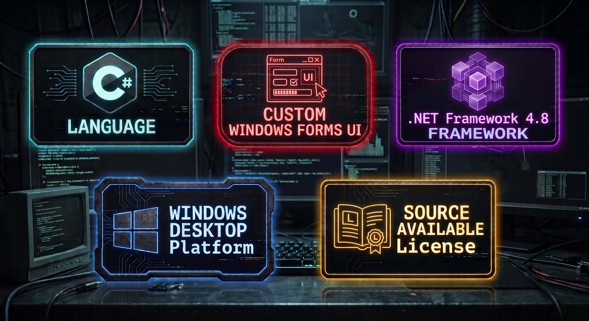
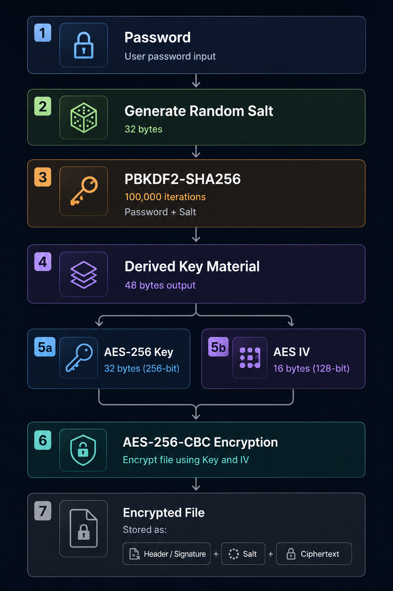

<div align="center">


# SB File Encryptor & Decryptor
> 🔒 **Privacy First** • 💻 **Fully Offline** • 🚫 **No Telemetry** • 🔑 **AES-256 Encryption**

Protect documents, archives, photos, videos, backups, and other sensitive files using industry-standard AES-256-CBC encryption—entirely offline and fully under your control.
<br>

<div align="center">

<br>

<br>

</div>
</div>

<br>

## 📥 Downloads

Pre-built executable versions are available in GitHub Releases.

👉 [Latest Release](https://github.com/suleymanbeyhan28/sb-file-encryptor-and-decryptor/releases)

---

## 🖼️ Application Preview

<p align="center">
  
</p>

<p align="center">
  <b> Modern WinForms UI with custom controls and enhanced UX </b>
</p>

---

## 🎬 Video Demonstration

<p align="center">
  <a href="https://www.youtube.com/watch?v=iy-5eJQGd1I">
    
  </a>
</p>

<p align="center">
  <b> Click the image to watch the full demonstration</b>
</p>

---

## 🎯 Designed For

SB File Encryptor & Decryptor is designed for anyone who wants complete local ownership of their files.

Perfect for:

- 👤 Individual users protecting personal documents
- 💼 Freelancers handling client files
- 🏢 Small businesses managing confidential data
- 📦 Backup archives
- 📷 Personal photos and videos
- 📄 Sensitive PDF and Office documents
- 💾 External drives and offline storage

Whether you are encrypting a single file or an entire archive, the application is designed to remain intuitive, predictable, and fully under your control.

---

## 🔒 Why SB File Encryptor & Decryptor?

SB File Encryptor & Decryptor is a Windows desktop application designed for users who want complete local control over their data.

Unlike cloud-based encryption services, all operations occur directly on your computer.

The interface is designed to be simple and intuitive, allowing you to focus on encrypting or decrypting files without navigating complex settings or unnecessary options.

No technical expertise is required, making the application accessible to users of all experience levels.

### Key Benefits

* 🔐 **AES-256-CBC Encryption** – Industry-standard file encryption.
* 🔑 **Access Control** – Password-Based Encryption.
* 📁 **Universal Compatibility** – Compatible with virtually any file type.
* ⚡ **Efficient Processing** – Fast with real-time progress monitoring.
* 🚫 **Privacy First** – No cloud services, telemetry, or analytics.
* 🔒 **Complete Control** – Fully offline operation.

Whether you're protecting personal documents, backups, archives, business files, or confidential information, the application emphasizes security, privacy, reliability, and ease of use.

---

## 🚀 Features

### File Protection

* 📁 **Format Support** – Encrypt and decrypt virtually any file format.
* 🔑 **Secure Access** – Password-protected access to encrypted files.
* 🛡️ **Unauthorized Access Protection** – Protection against unauthorized access.

### User Experience

* 👤 **Modern Interface** – Modern Windows Forms interface.
* 👁️ **Password Visibility** – Toggle to view password.
* 📊 **Live Progress** – Real-time progress tracking.
* 🔔 **Smart Notifications** – Snackbar notification system.
* 📱 **DPI-Aware** – Sharp design across displays.
* ✅ **Clear Feedback** – Clear validation and error handling.

### Reliability

* 🔄 **Large File Support** – Stream-based processing for large files.
* ⏹️ **Operation Cancellation** – Safely cancel running tasks.
* 🧹 **Automatic Cleanup** – Removes temporary files after failures or cancellation.
* 🔒 **Locked File Detection** – Avoids file conflicts.
* 💾 **Storage Check** – Disk space validation.
* 🛡️ **Collision Protection** – Input/output collision protection.

---

## 🔐 Security Architecture

Security is the primary focus of this project.

### Encryption

* **AES-256-CBC Encryption**
* **AES Key and IV derived via PBKDF2-SHA256**

### Key Derivation

* **PBKDF2-SHA256**
* **100,000 Iterations**
* **Unique 32-byte Random Salt** for every encrypted file.

### Validation & Protection

* **Custom Encrypted File Signature Validation** ("SB_EncryptedFile").
* **Password Verification through Cryptographic Validation** to detect incorrect passwords.
* **Corrupted File Detection**
* **Unsupported File Detection**

> [!IMPORTANT]
> A unique 32-byte cryptographically secure random salt is generated for every encryption operation. The salt is stored alongside the encrypted file and is used with PBKDF2-SHA256 to derive a unique AES-256 encryption key and IV for each file.

### Encryption Workflow
<div align="center">

<br>

</div>

---

## 💾 Privacy & Data Policy

This application operates **entirely offline**.

The application does not:

* Collect user data
* Track activity
* Upload files
* Send analytics
* Communicate with external servers

All encryption and decryption operations occur locally on your device.

Your files remain under your control and are never uploaded or transmitted to third parties.

---

## ⚙️ Technical Highlights

These engineering decisions were made to maximize reliability, responsiveness, and performance.

| Technology | Why It Matters |
| :--- | :--- |
| Async/await | Keeps the UI responsive during long operations. |
| Stream-based Processing | Encrypts very large files without excessive memory usage. |
| 1 MiB Buffered I/O | Improves throughput while maintaining stability. |
| Automatic Cleanup | Prevents leftover temporary files after failures or cancellations. |
| Secure Validation Workflow | Detects unsupported or corrupted encrypted files before processing. |

---

## 🎨 UI Components & Custom Controls

### 🧩 SBCustomControls.dll

A lightweight custom UI library used throughout the application.

| ✨ Features | 🔗 Resources |
| :--- | :--- |
| • Modern rounded controls<br>• Hover and click animations<br>• DPI-aware rendering<br>• Consistent application styling<br>• Lightweight reusable controls | 📦 **Location:**<br>`Lib/SBCustomControls.dll` |

### 🔔 Snackbar Notification System

A modern notification system designed to provide elegant user feedback without interrupting the workflow.

| ✨ Features | 🔗 Resources |
| :--- | :--- |
| • Success, Error, Warning, Info states<br>• **Customizable Duration:** Define exactly how many milliseconds the message should stay visible.<br>• Auto-dismiss functionality<br>• Smooth UI animations<br>• Non-blocking architecture | 📦 **Local:** `UI/Snackbar.cs`<br><br>🌐 **Standalone Component:**<br>[**👉 Go to SB Snackbar Repo**](https://github.com/suleymanbeyhan28/sb-winforms-snackbar) |

---

## 🖥️ System Requirements

### Minimum

* Windows 10
* 4 GB RAM
* Dual-Core CPU

### Recommended

* Windows 10 / Windows 11
* 8+ GB RAM
* Quad-Core CPU
* SSD Storage

---

## 🛠️ Installation

### Clone the Repository

```bash
git clone https://github.com/suleymanbeyhan28/sb-file-encryptor-and-decryptor.git
```

### Build and Run

1. Open the solution in **Visual Studio 2022** or newer.
2. Restore dependencies if required.
3. Build the project.
4. Run the application.

---

## 📜 License

This project is made available free of charge for personal and other non-commercial use under the **PolyForm Noncommercial License 1.0.0**.

You may inspect, use, modify, and share the source code for non-commercial purposes, provided that the license and copyright notice remain with every copy. Commercial use—including selling the software or modified versions—is not permitted. Copyright and ownership remain with the original author.

See [LICENSE](LICENSE) for the applicable terms.

---
## 💖 Optional support

If this project is useful to you, you may optionally send a donation. No contribution is required, and no benefits, access, or commitments are associated with a donation.

**Bitcoin (BTC) address:**

```text
bc1qraj6jdvnz0wyge42mrtc7jr72n74cttzqukcw6
```

---
## 🤝 Contributions

Bug reports, suggestions, and pull requests are welcome.

Areas where contributions may be helpful:

* Performance improvements
* Security reviews
* UI enhancements
* Bug fixes
* Documentation improvements

### Contribution Workflow

```bash
git checkout -b feature/AmazingFeature
git commit -m "Add AmazingFeature"
git push origin feature/AmazingFeature
```

Then open a Pull Request.

All accepted contributions may be incorporated into future versions of the project at the author's discretion.

---

## 💬 Feedback

Suggestions, bug reports, feature requests, and improvement ideas are always welcome.

**Feedback Form:**
👉 [https://forms.gle/1r5Ho11SU1vEXY9e9](https://forms.gle/1r5Ho11SU1vEXY9e9)

---

## 📩 Contact

**🌐 Website / Blog**
[https://suleymanbprojects.blogspot.com/](https://suleymanbprojects.blogspot.com/)

**📧 Email**
[sbprojects.requests@gmail.com](mailto:sbprojects.requests@gmail.com)
